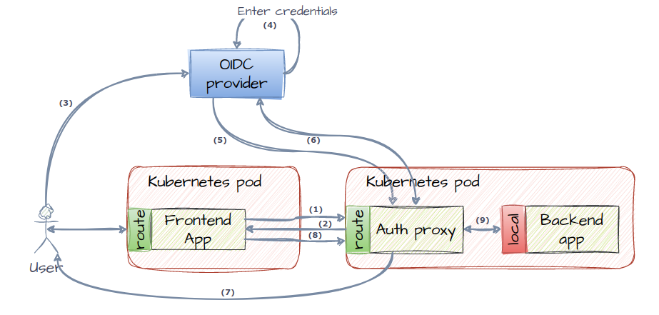
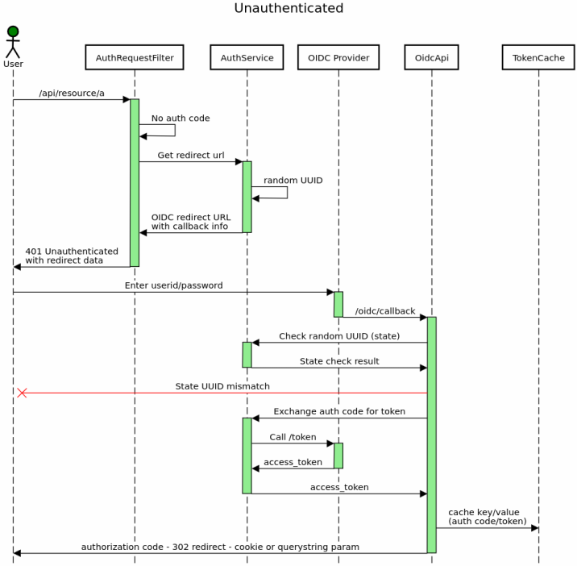
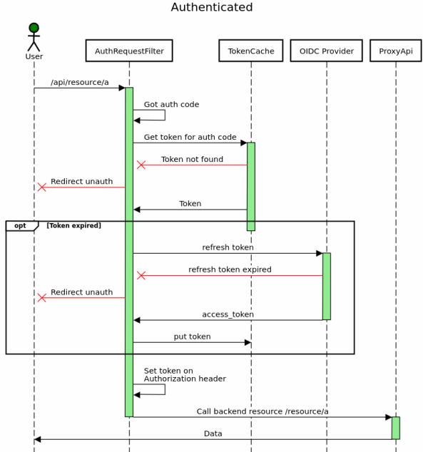

# QProxy

A simple, fast, configurable OIDC proxy for plug-in token-based security.

This application is built for running in a container image, ideally as a [kubernetes sidecar](https://betterprogramming.pub/kubernetes-authentication-sidecars-a-revelation-in-microservice-architecture-12c4608189ab). However, it could just as easily run as a standalone app.


When configured using environment variables, it will serve as a reverse proxy and token cache between a frontend user and any backend application requiring JWT bearer Authorization headers.

## Architecture

When an end user wants to interact with any frontend application that communicates with a backend app, this auth proxy can be deployed together with the backend app in the same kubernetes pod. The basic idea behind the *sidecar* pattern is to take advantage of the fact that containers within the same pods share the same network. Backend app does not have any routes for incoming traffic, communication between auth proxy and backend is strictly on localhost interface. 

### Overview



### Steps involved

1. User loads application page which will generate requests to backend for data.
2. Auth proxy will check for authorization code on either Authorization header or inside auth cookie (depending on configuration). For the first request, it will find neither. In this case a `HTTP 401 Unauthorized` response will be returned together with payload containing redirect URL (see example below).
3. Client should check for 401 responses and set `window.location.href` to the URL received in step 2. This will present the authentication UI of the OIDC provider to the end user. 
4. User enters credentials and submits.
5. Upon successful authentication, OIDC provider redirects back to the `/oidc/callback` auth proxy endpoint with information such as `state` and `code` (authorization code). 
6. Exchange the auth code for a full token set (access token and refresh token). Access token is in the form of a JWT. At this point we store the token using auth code as key to minimize number of calls to OIDC backend. 
7. A redirect is sent back to the client browser and, depending on configuration, we set a cookie or return an `Authorization` header containing the authorization code (not the full JWT). 
8. A new backend request is sent, this time containing a valid authorization code as a Bearer token header or in a cookie. 
9. Auth proxy will look up cached tokens by the authorization code recieved, and set up the access token as a Bearer token header backend client call. Backend should still validate the token received.

Example payload returned in step 2:

```json
{
    "redirect_to": "https://oidc.bigcorp.com/application-realm/protocol/openid-connect/auth?response_type=code&client_id=my-client-id&scope=openid&redirect_uri=http%3A%2F%2Flocalhost%3A8080%2Foidc%2Fcallback&state=383fe246-c2e5-46f7-a9b3-b873fc047196"
}
```

If the cached token in step (9) has expired, we will make a call to the OIDC provider using the refresh token to acquire a new access token. If this step fails, we will remove the cached entry and repeat from step 1. 

If backend uses role-based authorization it may send `403 Forbidden` responses. These will make it all the way back to the client. 

### More information

[OAuth Authorization Code Flow Example](https://www.appsdeveloperblog.com/keycloak-authorization-code-grant-example/)

## Sequence diagrams

These digrams show the request flow sequence for the first and all subsequent requests.

### First request

The very first request will be unauthenticated, so for all requests lacking authentication information (cookie or header), we will initiate the [OAUTH2 Authorization Code Flow](https://auth0.com/docs/get-started/authentication-and-authorization-flow/authorization-code-flow). 



If auth code is returned to the client using a query string param (config type `BEARER`), the client is responsible for storing this. If we're using a cookie, the browser will store it and send it back on each request.  

### Subsequent requests

All subsequent requests should either pass a cookie OR an Authorization header containing the authorization code received during the initial authentication phase. If the referenced access token is expired, we will use the refresh_token to try to acquire a fresh token. 



# Configuration

The proxy can be configured through a series of environment variables described below.

## Core config

### `AUTHENTICATION_TYPE`

Mandatory setting. Defaults to `UNKNOWN` if no valid value has been set. 

| Value      | Description |
| ---------- | ----------- |
| COOKIE | Set client cookie containing auth code / reference token |
| BEARER | Return the auth code as a query string parameter to the client |

### `AUTHENTICATION_COOKIE_NAME`

Name of cookie set if `AUTHENTICATION_TYPE` is `COOKIE`. Defaults to `c_auth_proxy`. Cookie will be returned on the response of a HTTP `302 Found`, where `Location` is the value of the `AUTHENTICATION_FRONTEND_REDIRECT` variable.

### `AUTHENTICATION_COOKIE_DOMAIN`

Cookie domain used by cookie-based authentication. Defaults to `localhost`. Must be set to actual domain when running in staging or production.

### `AUTHENTICATION_COOKIE_SAMESITE`

Which value to use for cookie `SameSite` attribute. Can be either `NONE`, `LAX`, or `STRICT`. Defaults to `LAX`.

### `AUTHENTICATION_BACKEND_HEADER_NAME`

Which header name to use when passing full access_token (JWT) to backend. Defaults to `Authorization`.

### `AUTHENTICATION_FRONTEND_REDIRECT`

Which URL to redirect to after succesful authentication. Defaults to `http://localhost:8080`.

If authentication type has been set to `BEARER`, this variable is tightly coupled with the next:

### `AUTHENTICATION_FRONTEND_CALLBACK_PARAM`

The name of the query string parameter used for passing auth code back to frontend. Defaults to `authcode`. Example: if `BEARER` type authentication has been selected, and only default values are used, a HTTP `302 Found` will be returned with a `Location` header containing the URL `http://localhost:8080?authcode=<UUID>`. The frontend code is then responsible for storing auth code UUID and passing it back in an Authorization header as a Bearer token. 

## OIDC Provider configuration

This section lists environment variables relevant to the OIDC provider selected. 

### `AUTHENTICATION_OIDC_PROVIDER_CONF_URL`

Mandatory setting. Points to the .well-known URL of the OIDC provider. Example: to use Google, use this value: `https://accounts.google.com/.well-known/openid-configuration`.

### `AUTHENTICATION_OIDC_AUTH_URI_TEMPLATE`

Used in conjunction with `AUTHENTICATION_OIDC_BASE_URL` to generate the full OIDC redirect URL. A simple string template where `%s` is replaced by actual values in the given order before being appended to the base URL. Defaults to `/auth?response_type=%s&client_id=%s&scope=openid&redirect_uri=%s&state=%s`. 

URI has four variable parts, that are replaced with actual values in environment variables:

| Value      | Description | Replaced with |
| ---------- | ----------- | -------------- |
| response_type | Must be supported by OIDC provider response types. Defaults to `code`. | `AUTHENTICATION_OIDC_RESPONSE_TYPE` |
| client_id  | ID of the client as registered with the OIDC provider | `AUTHENTICATION_OIDC_CLIENT_ID` |
| redirect_uri | URL-encoded uri that the OIDC provider should make its callback to | `AUTHENTICATION_OIDC_REDIRECT_URI` |
| state | UUID to be validated when OIDC provider calls back | Generated |

## Miscellaneous settings

### `BACKEND_HEADER_PROPAGATION`

Comma-separated list of headers to propagate to proxied backend requests. Defaults to `Authorization, X-Correlation-Id`.

### `AUTHENTICATION_CORS_ALLOW_ORIGINS`

Comma-separated list of allowed origins. Defaults to `/https://([a-z0-9\\-_]+)\\.my\\.corporation\\.net/` in everything else than Quarkus DEV. When running in DEV mode, all origins are allowed. 

### `BACKEND_HOST_BASE_URL`

Mandatory value. URL and port for protected backend ressource. Please note that uri path must always begin with an `/api` node. This node will be removed before making the backend call. 


# Quarkus

This project uses Quarkus, the Supersonic Subatomic Java Framework.

If you want to learn more about Quarkus, please visit its website: https://quarkus.io/.
